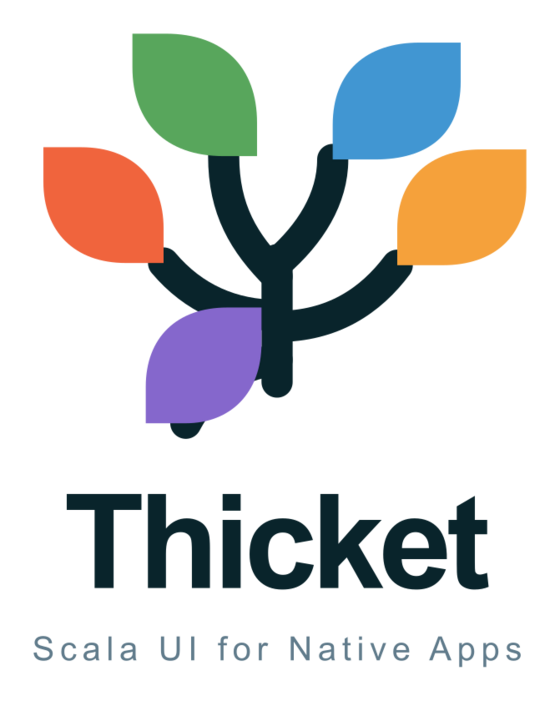
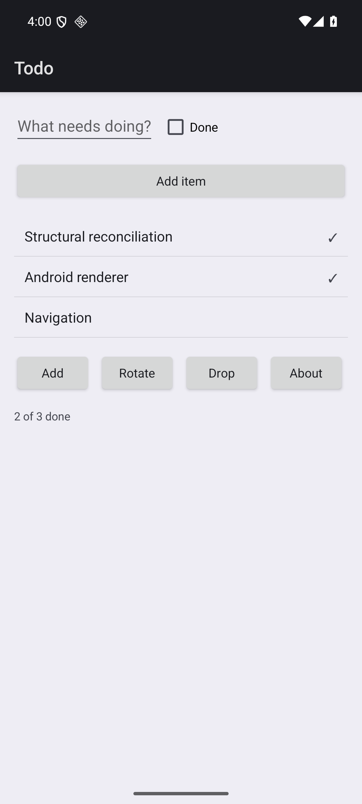

<p align="center">
  
</p>

# Thicket

**Native thick-client UIs in Scala 3.** One `Element` tree, real platform widgets —
`android.view.*` on Android, UIKit/AppKit on iOS and macOS, GTK4 on Linux.

Scala 3.9 · sbt 2.0.9 · Scala Native 0.5.12 · Apache-2.0 · **pre-release, not on Maven Central yet**

<p align="center">
  
</p>

---

## Why

Scala covers the server (JVM), the browser (Laminar, Tyrian) and the command line (Scala
Native). It has **no answer for the thick client** — no way to ship a Scala app to a phone
or a desktop that looks and feels like it belongs there. Kotlin has Compose Multiplatform,
Dart has Flutter, JS has React Native, C# has MAUI, Rust has Tauri. Scala has nothing, and
that gap keeps it out of an entire class of products.

Thicket does not draw its own widgets. Every leaf of the tree is a real `GtkButton`,
`android.widget.Button` or `UIButton`, so platform fidelity is true *by construction* and
accessibility comes with the control rather than being retrofitted onto a canvas.

## Status — read this before you start

| | |
|---|---|
| Works today | Linux/GTK4, Android, macOS, iOS simulator — the same app on all four |
| Widgets | **17 of 32** as widgets, all of them on **every** renderer; **21 of 32** covered once you count the four the catalogue lists as widgets and this framework deliberately does not → [docs/12](docs/12-component-status.md) |
| Navigation | Native container on all four: `AdwNavigationView`, a `FrameLayout` + `Slide`, `UINavigationController`, a macOS sidebar. Back gesture and title bar are the platform's own |
| Theming | By role, scoped to a subtree with `Provide` |
| Published artefacts | `dev.thicket`, tagged **v0.1.0** — but not on Maven Central yet, so `publishLocal` is the only route. [docs/14](docs/14-releasing.md) |
| API stability | **None.** Expect breaking changes without notice |
| Windows | Not started, and out of the 0.1 scope |

This is early, and the honest shape of it is: the parts that exist are finished on all four
platforms rather than sketched on one. Seventeen widgets, every one on every renderer, with
a self-test on each host that reads the tree back out of the real toolkit.

What is genuinely missing: seven catalogue entries, of which `Picker` and `DatePicker` are
the ones a form actually wants; Maven Central publishing; and an Apple getting-started, since
an Apple consumer needs a Swift static library this repo builds with a shell script rather
than just a dependency line. A GTK app can be built from outside this repo today —
`bin/verify-getting-started.sh` checks exactly that — but it has to copy a dozen lines of
our `nativeConfig`, because nothing publishes them yet.

## Getting started

### Prerequisites

| For | You need |
|---|---|
| Everything | JDK 21+, [sbt 2](https://www.scala-sbt.org/) (`cs install sbt`), [coursier](https://get-coursier.io/) |
| Linux desktop | the apt packages below |
| Android | Android SDK (platform 36 + build-tools), an emulator or device |
| macOS / iOS | Xcode, on a Mac — see [spikes/MAC-SETUP.md](spikes/MAC-SETUP.md) |

### Linux

```bash
sudo apt install clang libunwind-dev pkg-config libgtk-4-dev libadwaita-1-dev
```

| Package | Needed for | Verified against |
|---|---|---|
| `clang` | Scala Native compiles and links through it | 21.1.6 |
| `libunwind-dev` | Scala Native's unwinder — the runtime will not link without it | 1.8.3 |
| `pkg-config` | the build runs `pkg-config --cflags gtk4 libadwaita-1` and the matching `--libs` to get the compile and link flags, so a missing `pkg-config` fails the *build*, not just the link — and says which packages to install | 2.5.1 |
| `libgtk-4-dev` | the GTK4 renderer | 4.22.4 |
| `libadwaita-1-dev` | `AdwNavigationView`, for native navigation containers. GTK core has no equivalent — `GtkStack` gives transitions but no back-gesture semantics | 1.9.1 |
| `python3` | `bin/coverage.sh` reads the scoverage report with it | any 3.x |

The `-dev` packages are the point: the runtime libraries alone are not enough, because
Scala Native compiles against the C headers.

Everything else is fetched by coursier and needs nothing installed.

### Run the demo in one command

```bash
git clone git@github.com:rleibman/thicket.git
cd thicket
sbt --error counterGtk/nativeLink
./target/out/native0.5/scala-3.9.0/counter-gtk/counter-gtk
```

That is the Todo demo: a bound text field, a checkbox, keyed list rows, navigation, and a
10 000-row virtualised list. The first `nativeLink` takes a few minutes; after that it is
seconds.

For Android, with an emulator running:

```bash
./examples/todo-android/build.sh   # builds the Scala, hands the JAR to Gradle, installs, launches
```

### Or see every component at once

```bash
sbt --error galleryGtk/nativeLink
./target/out/native0.5/scala-3.9.0/gallery-gtk/gallery-gtk
```

`examples/gallery` is one screen holding every component the framework has, built for all
four platforms. It is a conformance surface rather than a showcase: `TestRenderer` answers
for every widget, so a widget that renders on GTK and does nothing at all on Android would
pass the whole unit-test suite. Only a screen that uses everything, rendered by each real
toolkit, catches that — which is why adding a component without adding it here is treated as
an incomplete change ([docs/12](docs/12-component-status.md) §12.10).

`THICKET_GALLERY_SELFTEST=1` makes it read the tree back out of the toolkit and print
pass/fail per component.

### Your first app

This is `examples/counter-gtk/src/main/scala/example/Counter.scala` in full — the smallest
complete Thicket app, and it compiles:

```scala
package example

import thicket.core.AppRoot
import thicket.core.dsl.*
import thicket.renderer.gtk.GtkApp
import thicket.signals.Var

object Counter {

  def main(args: Array[String]): Unit = {
    val _ = GtkApp.run("dev.thicket.counter", 380, 220) {
      val count = Var(0)

      AppRoot(
        "Thicket counter",
        Column(spacing = 16, padding = 24)(
          Label(count.map(n => s"Count: $n")),
          Row(spacing = 8)(
            Button("−")(count.update(_ - 1)),
            Button("+")(count.update(_ + 1)),
            Button("Reset")(count.set(0))
          )
        )
      )
    }
  }
}
```

Point `counterGtk`'s `Compile / mainClass` at `example.Counter` in `build.sbt`, then
`nativeLink` and run it as above.

### Your own project, outside this repo

`templates/hello-thicket` is a complete standalone sbt project — copy it anywhere:

```bash
cp -r templates/hello-thicket ~/my-app && cd ~/my-app
sbt nativeLink && ./target/out/native0.5/scala-3.9.0/hello-thicket/hello-thicket
```

It depends on published artefacts rather than on this repo. Until there is a tagged release
you need a local publish first:

```bash
cd /path/to/thicket && sbt 'signalsNative/publishLocal; rendererApiNative/publishLocal; coreNative/publishLocal; rendererGtk/publishLocal; sbtThicket/publishLocal'
```

The whole of the build configuration is one plugin:

```scala
// project/plugins.sbt
addSbtPlugin("dev.thicket" % "sbt-thicket" % thicketVersion)

// build.sbt
lazy val app = project.in(file(".")).enablePlugins(ThicketGtkPlugin)
```

`ThicketGtkPlugin` brings `sbt-scala-native`, adds `thicket-core` and `thicket-renderer-gtk`
at its own version, and sets the GTK `nativeConfig` — the `pkg-config` compile and link
flags, `LTO.none`, `Mode.debug`, `GC.immix`. Before it existed an app copied about a dozen
lines of that out of Thicket's own `build.sbt`, and got a link failure with nothing pointing
at the cause if it got the GC wrong. The flags are not a second copy: `build.sbt` and the
plugin compile the same source file. See
[tools/sbt-thicket/README.md](tools/sbt-thicket/README.md).

If you would rather name the artefacts yourself, the suffixes are explicit because **sbt 2
has no `%%%`**:

```scala
libraryDependencies ++= Seq(
  "dev.thicket" % "thicket-core_native0.5_3"         % thicketVersion,
  "dev.thicket" % "thicket-renderer-gtk_native0.5_3" % thicketVersion
)
```

**Apple is not covered yet.** The plugin is GTK only — an Apple app also needs a Swift static
library this repository builds with a shell script and does not publish, and on iOS no `main`
of its own, so a plugin would not be enough. Tracked as #41.

`./bin/verify-getting-started.sh` checks all of the above still works, by building the
template outside the repo against a fresh local publish. See
[docs/14-releasing.md](docs/14-releasing.md) for versions and the compatibility policy.

**What is going on.** `count` is a `Var` — a signal. `count.map(...)` is a derived view, not
a subscription, so it needs no lifetime management. `Label` takes either a `String` or a
`Signal[String]`; given a signal, a change re-renders that one label and nothing else. There
is no `setState`, no virtual-DOM diff of the whole app, and no effect type in sight.

### The three concepts

**1. Signals.** Fine-grained reactivity — push-mark, pull-validate, glitch-free, with an
equality cutoff. A change touches only the widgets that actually read it.

```scala
val items = Var(List.empty[Item])
val done  = items.map(_.count(_.done))   // a derived view: no Owner, no disposal
val label = Signal.computed(s"${done()} of ${items().size} done")   // memoised, scoped
```

**2. Elements.** A description of the UI, not the UI itself. Structure that changes over
time is explicit, so the reconciler knows what to do with it:

```scala
Show(model.isEmpty)(Label("Nothing left to do."))            // conditional subtree
Switch(route)(r => screenFor(r))                             // one of N
ForEach(items, key = (i: Item) => i.id) { item => ... }      // keyed; reorders in place
LazyColumn(items, key = (i: Item) => i.id) { item => ... }   // virtualised: only visible rows exist
```

**3. Effects at the edges.** The core is synchronous and effect-free. ZIO arrives through a
bridge, so a ZIO service layer drives the UI without the widget API knowing about `F[_]`:

```scala
val user: Signal[RemoteData[Throwable, User]] = fetchUser(id).asSignal
Switch(user) {
  case RemoteData.Loading   => Label("Loading…")
  case RemoteData.Failed(e) => Label(s"Failed: ${e.getMessage}")
  case RemoteData.Done(u)   => Label(u.name)
}
```

A cats-effect bridge is planned; the core needs no change to accept one.

### Theming

Name a *role*, not a colour. Roles map to each platform's own tokens, so dark mode and the
user's accessibility contrast settings keep working:

```scala
Theme.install(Theme.platform.withColor(ColorRole.Accent, Rgb(0x2E, 0x6F, 0x40)))
```

There is deliberately no way to say "grey #767676". A theme that pushes its own palette at
every platform is how cross-platform apps come to look like none of them.

### Running the same app on another platform

The app is a function; each host mounts it.

```scala
// Linux
GtkApp.run("dev.example.app", 460, 440) { MyApp(model) }

// Android, in onCreate
val mounted = Reconciler.mount(AndroidRenderer(this), app.element)
setContentView(mounted.handle)
```

`examples/shared/TodoApp.scala` knows nothing about any platform; `counter-gtk`,
`todo-android` and `todo-apple` each mount it in a handful of lines. That is the whole
porting story.

## What it measured

Not asserted — measured, with the method recorded in
[docs/10](docs/10-phase-0-findings.md) and the spike reports.

| | |
|---|---|
| App size (iOS hello app) | **0.53 MB** vs React Native 26.0 MB, Gluon 60.1 MB |
| Cold start (iOS simulator) | **425 ms** vs React Native 702 ms |
| Android cold start | 388 ms, against hand-written Kotlin's 418 ms |
| Android release APK | 165 KB |
| Signal update | 77 / 219 / 419 ns per node (JVM / Native / JS), budget 1 000 ns |
| Mount 10 000 rows | ~56 ms; single-row update ~1.5 ms |
| 10 000-row list | ~66 live views on Android, ~205 on GTK |

## Project layout

```
modules/
  signals/           fine-grained reactivity (JVM / JS / Native)
  renderer-api/      the renderer contract — one small, versioned interface
  core/              element tree, reconciler, navigation, theming
  effect-zio/        the ZIO bridge
  renderer-gtk/      GTK4           (Scala Native)
  renderer-android/  android.view   (Scala on ART)
  renderer-apple/    AppKit + UIKit (Scala Native + Swift shim)
examples/
  shared/            TodoApp — the platform-free demo every host mounts
  counter-gtk/  todo-android/  todo-apple/
docs/                the plan, the findings, the living status
spikes/              phase 0, one directory and REPORT.md per spike
```

Writing a renderer means implementing one trait — `create`, `update`, `insertAfter`,
`removeChild`, `destroy`, `measure`. It has absorbed four structurally different toolkits
without changing: [`modules/renderer-api`](modules/renderer-api/shared/src/main/scala/thicket/renderer/Renderer.scala).

## Development

```bash
sbt --error "signalsJVM/testOnly *; coreJVM/testOnly *; effectZioJVM/testOnly *"   # 98 tests

THICKET_SELFTEST=1 ./target/out/native0.5/scala-3.9.0/counter-gtk/counter-gtk       # GTK self-test
adb shell am start -n dev.thicket.todo/example.android.MainActivity --ez selftest true
```

Coverage over the JVM-tested modules:

```bash
./bin/coverage.sh          # 91.10% statement, 87.64% branch
```

It clears the sbt disk cache first, and that is not optional — see `docs/12` §12.9. The
figure covers the effect-free core; the three renderers are exercised by self-tests that
drive the real toolkit, which no coverage tool instruments.

Three things that will bite you:

- **`sbt test` is incremental on sbt 2** and will run *zero* tests and report success.
  Always `testOnly *`.
- **The Apple modules are not in the root aggregate**, on purpose, so Linux and Android
  builds are unaffected by them. Build them on a Mac.
- **Braces, not significant indentation.** `-no-indent` is on; the compiler rejects it.

Apple work is done on a macOS laptop and raised as issues rather than attempted elsewhere.

## Roadmap

Phase 0 is complete and returned **GO** ([docs/10](docs/10-phase-0-findings.md)). The work
is now phased towards a 0.1, one branch and one PR per phase —
[docs/13-phases.md](docs/13-phases.md).

0.1 is defined as a claim that can be falsified rather than a feature count: *an outside
developer can build and ship a real app for Android, iOS and one desktop without reading
the framework's source.*

## Documents

| # | File | Contents |
|---|---|---|
| 12 | [docs/12-component-status.md](docs/12-component-status.md) | **Start here.** Done vs left, per widget and per renderer |
| 13 | [docs/13-phases.md](docs/13-phases.md) | Phases, branches, PRs, exit criteria |
| 14 | [docs/14-releasing.md](docs/14-releasing.md) | Versions from tags, `early-semver`, what a consumer needs |
| 11 | [docs/11-what-it-looks-like.md](docs/11-what-it-looks-like.md) | The design ideas, and the gap each one exposed |
| 10 | [docs/10-phase-0-findings.md](docs/10-phase-0-findings.md) | Every phase-0 measurement and the GO decision |
| — | [docs/decisions.md](docs/decisions.md) | Versions, tooling, the dated decision log |
| — | [docs/screenshots/](docs/screenshots/) | What it looks like, read critically |
| 1–9 | [docs/](docs/) | The original plan: vision, landscape, requirements, architecture options, technical design, roadmap, open questions |

Docs 10–13 and `decisions.md` are living. Docs 01–09 are frozen background; facts marked
**[unverified]** there are claims a spike had not yet settled.

## Contributing

Early, and the most useful contribution is a widget or a renderer. Before starting:

1. Read [docs/12](docs/12-component-status.md) so you are not duplicating work, and
   [docs/decisions.md](docs/decisions.md) for the binding choices.
2. A widget is **done** only when every existing renderer implements it *and* a test
   exercises it. "Compiles" is not done.
3. Measure. Every claim in these docs is a number with a method; a PR that says "works"
   without one will come back.

## Licence

Apache-2.0. See [LICENSE](LICENSE).
