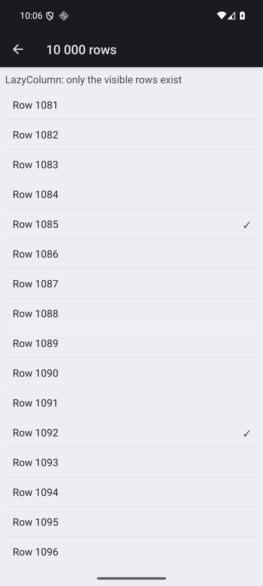

# 11. What the framework looks like

The companion to this document is [`examples/mockup/MealPlanner.scala.mockup`](../examples/mockup/MealPlanner.scala.mockup)
— a complete meal-o-rama mobile client written as if the framework were finished. It does
not compile and is not on the build path. Read the two together.

## 11.1 The thesis

Porting Flutter to Scala would be a waste of everyone's time. Flutter is good, Compose is
good, and "the same thing but in a language with fewer packages" is not a reason for anyone
to switch. If this framework is worth building, it is because **Scala 3's type system lets a
UI make guarantees the others cannot**, and because a ZIO shop can share its domain with the
server rather than re-describing it.

So the design goal is not parity. It is: *the compiler should reject the bugs that dominate
real UI work.* Blank screens from unhandled loading states. Navigating to a screen without
its arguments. Submitting a form the server will reject. Leaked subscriptions. A view calling
the network because nothing stopped it.

## 11.2 Seven ideas

**1. Navigation is a value.** `Route` is an ADT, so a screen cannot be reached without its
arguments, the back stack is a `List[Route]`, state restoration is serialising a list, deep
links parse into one, and a test asserts on it directly. No string paths, no route registry.

**2. The app is a total function `Route => Screen`.** Add a route, and the compiler tells you
which match is missing. There is no runtime "unknown route" branch because there is no way to
have one.

**3. Async is an exhaustive match.** Every ZIO reaching the UI arrives as
`Async[E, A] = Loading | Failed(e) | Done(a)`. The single most common UI bug — a blank screen
because loading or failure was not handled — becomes a non-exhaustive-match error. Flutter's
`FutureBuilder` and Compose's `collectAsState` both let you skip these; this does not.

**4. Capabilities are declared per screen.** `def PantryScreen()(using Nav, Pantry)` can
navigate and read the pantry, and *cannot* make an HTTP call, because it never asked for one.
This is ZIO's `R` channel pushed down to the view layer and checked at compile time, rather
than a service locator that fails at runtime.

**5. Validation lives in the type, and is the server's type.** `RecipeDraft` carries
refinements (`String :| NonEmpty`, `Int :| Between[1, 24]`) and is the *same class the
Caliban server validates against*. The Done button's `enabled` is derived from it, so you
cannot forget to disable it, and you cannot submit something the server will reject.

**6. Effects are owned by the component.** `launch` forks into the component's ZIO `Scope`.
Navigate away and the fiber is interrupted and the socket closed — not because someone wrote
a cleanup callback, but because the scope closed. This is the one idea taken straight from
ZIO rather than from Scala's type system, and it is why the ZIO bridge is first-class
(§7.13) rather than an adapter.

**7. Platform fidelity by refinement, not abstraction.** The default widget is already the
platform's own. `.platform(ios = …, desktop = …)` adds something on one platform, locally,
without forking the screen. Compare with the usual cross-platform bargain, where you get the
intersection of all platforms and bolt on escape hatches.

## 11.3 What this buys that the incumbents do not

| | Flutter | Compose MP | React Native | scala-ui (intended) |
|---|---|---|---|---|
| Unhandled loading state | runtime blank | runtime blank | runtime blank | **compile error** |
| Navigate without args | runtime | runtime | runtime | **compile error** |
| Screen performs unauthorised effect | possible | possible | possible | **compile error** |
| Submit server-invalid form | runtime | runtime | runtime | **compile error** |
| Domain shared with server | no | JVM only | no | **yes, all targets** |
| Native widgets | mimicked | mimicked | yes (desktop lags) | **yes, all five** |
| Leaked subscription | manual | manual | manual | **scope-closed** |

The last column is the pitch. If it does not hold, there is no reason to build this.

## 11.4 What exists today, honestly

Of the mockup, roughly **40%** is real. Concretely, after M0 + structural reconciliation:

| Real now | Invented in the mockup |
|---|---|
| `Signal`, `Var`, `computed`, `effect`, `Owner` lifetimes | everything ZIO-facing (`asSignal`, `launch`, `Async`) |
| `Element`, `Attr`, the reconciler, one effect per reactive attribute | `Screen`, `Nav`, `Route`, tabs, toolbars |
| **`Show` and `ForEach` with keyed diffing and in-place moves** | virtualisation (`LazyColumn`) — `ForEach` mounts every row |
| **`Route` ADT, `Nav` back stack, `Screen`, `NavHost`** | tabs, deep-link parsing (`derives Routable`) |
| **Native chrome via `AppRoot`** — title, Up, predictive back | toolbar actions (the type exists; no renderer applies them yet) |
| **`Fragment`** — several children in one slot | forms, refinements, `.platform`, swipe actions |
| `Column`, `Row`, `Label`, `Button`, **`TextField`, `Checkbox`, `Scroll`** | images, `Markdown`, `Thumbnail`, `Stepper`, `SearchField`, `Skeleton` |
| **`.onTap` / `.grow` modifiers, `TextRole`, `Alignment`** | `Theme`, colour roles, dark mode, press feedback, `.platform` refinement |
| **`RemoteData` as an exhaustive match, and the ZIO bridge behind it** | `Form.Schema`, refinement types, lens-based `Field` |
| The renderer contract + **GTK4 and Android renderers** + a `TestRenderer` | `TestApp`, `UiSpec` |
| **One shared UI mounting on Linux and Android unchanged** | `Async` as an exhaustive match |
| Owner never appears in app code | |

`ForEach` already gives the mockup's central promise: a row whose item keeps its key but
changes its data is **patched, not rebuilt** — measured at exactly one renderer call for one
changed item in a three-item list. What it does not yet do is *virtualise*, so a thousand
rows really are a thousand widgets. That is the difference between `ForEach` and the
mockup's `LazyColumn`, and it is a renderer-level concern (`UITableView`, `RecyclerView`,
`GtkListView`) rather than a reconciler one.

The counter in `examples/counter-gtk` is 14 lines and looks like the mockup's inner blocks
already. The gap is not in the *shape* of the API — it is in breadth and in everything above
the element tree.

## 11.5 The order to build it in

Each step is chosen to make the next one cheap, and to keep something runnable at every point.

1. ~~**Structural reconciliation**~~ — **done.** `Show`, `ForEach` with keyed diffing,
   `Fragment`, in-place reordering via a `moveAfter` contract primitive, and regions that
   nest and sit transparently between static siblings.
2. ~~**A second renderer**~~ — **done.** Android, via S2's sbt→JAR→Gradle shape. The
   contract survived a structurally different toolkit unchanged; see §11.7.
3. ~~**`Screen` and `Nav`**~~ — **done**, except for native navigation *containers*: see §11.8.
4. ~~**The ZIO bridge**~~ — **done.** `asSignal`, `launch`, `RemoteData`, component scopes,
   and S9 proved the whole of it under iOS.
5. **Widen the catalogue** — *in progress, and the long pole.* `TextField`, `Checkbox`,
   `Scroll` and `Image` landed; that is **9 of the 32** in `docs/07` §7.10. `docs/12` tracks
   which. This is also the moment to start *generating* the Apple shim rather than
   hand-writing it (S3).
6. ~~**The Apple renderer**~~ — **done**, and it took two shims from one module. It was last
   among the four on purpose: by then the contract was settled, and it needed no change to it.

Five of the six are done; step 5 is a quarter done and is now the whole game. That is why
`docs/12` §12.7 closes phase 0 and names the MVP — and why the next thing on the list is not
a widget but the **generator**, which is what makes the remaining 23 affordable.

Forms, refinements and `.platform` come after that. They are the most distinctive ideas and
the least urgent: nothing else depends on them.

## 11.6 The honest risk

Ideas 1–5 are cheap to state and expensive to make good. `Async` as an exhaustive match is
maybe fifty lines; making `Skeleton.list` look right on four platforms is not. The pattern in
this whole project so far has been that **the type-level ideas are easy and the platform
breadth is the work** — phase 0 measured exactly that, and the mockup should be read with it
in mind.

The other risk is that idea 7 is a promise about taste. "One declaration, three idioms" only
holds if someone keeps making judgement calls about what a swipe action *means* on GTK. That
is not a type system problem and it does not get easier with scale.

## 11.7 What the second renderer proved (and cost)

`examples/shared/.../TodoUi.scala` is mounted unchanged by the GTK renderer on Linux and by
the Android renderer on a phone. The same self-test — drive the model, read the widget order
back out of the *toolkit* — passes on both. The contract needed **no changes** to accommodate
Android, which is the first real evidence that it is an abstraction rather than a description
of GTK.

Where the two renderers genuinely differ is instructive:

| | GTK4 | Android |
|---|---|---|
| Child insertion | no insert-at-index; `prepend` / `insert_child_after` | `addView(child, index)` — index is native |
| Reorder | `gtk_box_reorder_child_after`, so `moveAfter` is overridden | no primitive; the contract's remove+insert default is used |
| Spacing | a box property | no such property — recomputed as child margins on every structural change |
| Threading | `g_idle_add` | `Handler(Looper.getMainLooper)` |

The `insertAfter`-by-sibling decision (from S7, because GTK has no index) turned out to cost
Android nothing: `indexOfChild(after) + 1` recovers the index. Had the contract been written
against Android first, it would have specified an index and GTK would have had to emulate it.

**What it cost: nothing measurable at startup, and 9–22 ms of real work.** An earlier draft
of this section claimed the framework added ~90 ms and had pushed the app over N-01. That was
wrong: it compared figures from two different emulator sessions. Measured properly — all three
APKs installed together, launched round-robin, 10 rounds each — the bare Kotlin activity, the
bare Scala activity and the full scala-ui todo app are **418 / 386 / 388 ms**, i.e.
indistinguishable, with Kotlin nominally slowest.

Instrumenting `onCreate` shows where the framework's time actually goes:

| phase | ms |
|---|---|
| process start → `onCreate` (class loading, ART) | 18–38 |
| build the element tree | 0–2 |
| **`Reconciler.mount`** | **9–20** |
| `setContentView` (Android's own measure/layout) | 11–38 |

So mounting a ~15-widget tree costs **9–20 ms**, and that is the number that will scale with
the catalogue. It is worth watching, but it is not a startup regression — the ~350 ms floor is
Android's process creation and first frame, which every app pays.

Release APK: **136 KB**, framework and app together.

## 11.8 Navigation: what landed, and the one thing that did not

Two of the mockup's seven ideas are now real:

**Navigation is a value.** `Route` is an app-defined ADT; the back stack is `List[Entry[R]]`;
`nav.routes.now` is what a test asserts on and what a host persists. The Android example
round-trips its stack through `onSaveInstanceState` as plain strings — no framework save/restore
protocol, because there is nothing framework-specific to save.

**The app is a total function `Route => Screen`.** `NavHost(nav) { case … }` takes a plain
function over the ADT, so adding a route breaks the match at compile time. There is no route
registry to forget to update.

Chrome travels beside the tree in `AppRoot`, never inside it, so each host applies it natively:
GTK sets the window title and packs a back arrow into the header bar; Android sets the action bar
title, shows Up, and registers an `OnBackInvokedCallback` so the **predictive back gesture** works.
`back()` returning `false` at the root is what lets the Activity finish normally — verified with a
real `KEYCODE_BACK`.

**What did not land: native navigation containers.** `NavHost` mounts only the top screen, so
pushing unmounts the screen beneath and popping rebuilds it. A `UINavigationController`, a
fragment back stack or a `GtkStack` keeps the whole stack alive, which is what preserves scroll
position and in-flight state across a push — and what provides the slide transition. That is a
renderer change behind the same API; the app-facing shape does not move. Until then, back
navigation is correct but forgetful.

### A renderer bug this exposed

Navigation was the first thing to unmount a whole subtree, and GTK objected immediately:

```
GtkButton 0x… has a parent GtkBox 0x… during dispose. Parents hold a reference,
so this should not happen. Did you call g_object_unref() instead of gtk_widget_unparent()?
```

The reconciler was detaching a region's top handles and *then* destroying the subtree
depth-first. On GTK, `gtk_box_remove` frees the removed widget's entire subtree, so the
depth-first destroy was touching freed memory. The contract now states that **`destroy`
detaches as well as releases**, and disposal is depth-first with no separate removal step. All
three renderers implement it; the `TestRenderer` models it too, or it would stop being a
reference implementation.

Worth noting what caught this: not the 32 unit tests, which passed throughout, but running the
app against a real toolkit that checks its own invariants.

## 11.8a What it actually looks like


`docs/screenshots/` holds a current shot per platform. They are worth looking at because
they say things the tests cannot.

The first Android screenshot caught a bug no test could: `targetSdk` 35+ forces edge-to-edge,
so the app was drawing *under* the status and action bars and the entire form row was
invisible. Fixed by padding with the system-bar insets — but that belongs in the framework,
not in every app, and there is no `SafeArea` element yet (F-02).

The second thing it showed was that the list rows were `Button`s, because a tappable
container did not exist. That is now fixed (§11.9), and a real touch on a row navigates,
with the action bar title following the stack and the Up arrow appearing on its own.

The third was that nothing was themed. That is now partly addressed — and the approach is
worth stating, because it is the opposite of what most cross-platform frameworks do.

**There is no palette.** `scala-ui` has no colour constants, no design tokens, no default
theme. A widget asks for a *role* — `TextRole.Caption`, `Emphasis.Secondary`, "this row is
tappable" — and each renderer maps it onto the platform's own token: a GTK style class
(`title-1`, `dim-label`, `activatable`), an Android theme attribute
(`?textColorSecondary`, `?selectableItemBackground`, `?listDivider`). Nothing is ever
specified in pixels or hex.

That buys three things for free: dark mode, the user's font-size and contrast settings, and
the platform's own press feedback — none of which a framework-owned palette can give you,
and all of which F-02 requires.

An app that *wants* to brand itself overrides individual roles:

```scala
Theme.install(Theme.platform.withColor(ColorRole.Accent, Rgb(0x2E, 0x6F, 0x40)))
```

One line, and buttons carry the brand while text, dividers, the check box, the text field and
the action bar all still follow the user's platform theme. **An empty theme is the correct
theme** for an app that wants to look native, and it is the default.

Overriding does hand the app a responsibility the platform was carrying, and the first
screenshot of a branded build showed exactly that: dark text on a dark green button, because
the app had set a background and the platform's text colour had been chosen for the
platform's background. So `ColorRole.OnAccent` is **derived from the accent's WCAG relative
luminance** when the app does not supply it. Branding cannot silently produce unreadable
text; an app that wants a specific foreground still sets one.

Still missing: per-subtree overrides (`Provide`), and `.platform` refinement.

## 11.9 Input widgets, and the rule they forced

`TextField`, `Checkbox` and `Scroll` are the first widgets where data flows *back* from the
toolkit, and they turned up a contract rule that the four read-only widgets never could:

> **A renderer must not disturb a widget when written a value it already shows.**

The reconciler cannot enforce this. After a user types, the app writes the new value back
through a signal, and from the reconciler's side that is a genuine change it has never
applied — it has no idea the widget already shows it. Only the renderer can compare against
what the widget actually holds. Skipping the write is what stops the caret jumping to the end
on every keystroke, and on toolkits whose widgets emit a change event when set
programmatically, it is what stops a bound field looping forever.

All three renderers implement it, and `TestRenderer` counts *writes that landed* so a test can
assert the echo was swallowed rather than merely that the value was right.

Note what is deliberately **not** automatic: nothing closes the loop for you. `TextField`
shows a signal and reports edits; whether the edit is written back is the app's decision.
That is what makes validation, rejection and transformation possible — a field that
upper-cases as you type is four lines, not a fight with the framework.

### Images: the framework renders bytes, it does not fetch

An earlier draft of this section said images were a subsystem — source abstraction, async
decoding, a cache with an eviction policy, placeholder and failure states — and therefore
needed a design rather than an enum case. Half of that was right. The design turned out to
be a *subtraction*.

`Image` takes local data only: `ImageSource.FromFile` or `FromBytes`. There is deliberately
no URL overload. An app that needs an image over the network already has an effect system,
and the result composes with everything else:

```scala
RemoteData(imageBytes) {
  case RemoteData.Loading   => Skeleton()
  case RemoteData.Failed(e) => Label(s"No image: ${e.message}")
  case RemoteData.Done(src) => Image(src, fit = ContentFit.Cover)
}
```

Loading and failure are the same exhaustive match as any other async value, and the retry
policy, the cache and the HTTP client stay in the app, where they already exist and where
they can be tested without a UI. A framework-owned fetcher would duplicate all of it and do
it worse — and it is exactly the kind of thing that is impossible to remove later.

**The one real limitation:** decoding happens on the UI thread. For a thumbnail that is
fine; for anything large an app should decode off-thread and hand over a file path. Making
the renderer decode asynchronously is worth doing, and is a renderer change rather than an
API one.

## 11.10 How it scales, measured

N-02 asks for a 10 000-row list at 60 fps. `ForEach` mounts every row, so that is where the
reconciler was most likely to fall over. Measured against the in-memory `TestRenderer`, which
does no layout or drawing — so these are *framework* costs, not toolkit costs
(`ScaleSuite`, 10 000 rows = 30 001 widgets):

| operation | before | after | note |
|---|---|---|---|
| mount 10 000 rows | 340 ms | **64 ms** | one-off; still the case for virtualisation |
| change one row (warm median) | — | **0.83 ms** | 1 renderer op; 20× inside a frame |
| append to 10 000 rows | 20 ms | **1.0 ms** | |
| prepend to 10 000 rows | ~6 ms | ~23 ms | the honest worst case: every entry shifts |

Three things came out of measuring rather than guessing:

**The update path was O(n), not O(1).** Changing one row of 10 000 did exactly one renderer
write — the op count was right all along — but took **19 ms**, a dropped frame, because
`reconcile` rebuilt a key map, a key set, a filtered list and a fresh vector on every change.
A fast path for "same keys, same order" — which is what every data-only change looks like —
removes all four allocations. A second fast path for "existing entries are a prefix of what
is wanted" does the same for appends.

**Mounting was accidentally quadratic, and the cause was in the renderers.** `insertAfter`
takes a *preceding sibling*, so a renderer must locate it — and `indexOf` / `indexOfChild` is
a linear scan, which makes mounting a list of n items O(n²). Checking the tail first, since
mounting a list is n appends, took 10 000 rows from 304 ms to 74 ms. That was a real bug in
the **Android** renderer, not just the test one.

**Virtualisation was still needed, but for a narrower reason than assumed** — and it now
exists. The update path was already inside frame budget at 10 000 rows; what remained was the
one-off mount cost and, more importantly, *memory*: 10 000 rows really were 30 001 live
widgets. See §11.11.

## 11.11 `LazyColumn`, and the one place the framework hands over control



Measured on the emulator with 10 000 rows, scrolled to row 1 081: **66 views**, ~28 MB PSS.
The equivalent `ForEach` would be 30 001 views.

Everywhere else in the framework the reconciler builds a tree and the renderer obeys. A
recycling container inverts that: it asks for the row it is about to show and hands back the
ones it is not. So `RowSource` is the one interface the *framework* implements and the
*renderer* calls:

```scala
trait RowSource[H] {
  def count: Int
  def bind(index: Int, recycled: Option[H]): H
  def discard(handle: H): Unit
  def onInvalidate(callback: () => Unit): Unit
}
```

The interesting part is `recycled`. When Android's `ListView` hands back a `convertView`, the
framework does not rebuild that row — it writes the new item into the row's own `Var`, and
the row's signals update exactly the widgets bound to changed fields. Scrolling a long list
therefore costs a few property writes per row, which is the same mechanism that makes a
single-row edit cheap. The fine-grained reactivity and the recycling turn out to be the same
idea.

**A renderer without a virtualising container is not deficient.** `supportsVirtualRows`
defaults to false and the framework falls back to mounting every row — correct, just heavier.
The fallback wraps itself in a container so that a `LazyColumn` is one widget on every
renderer; otherwise the same element would produce a different tree shape depending on who
was drawing it.

**Both renderers now virtualise**, and this is where the contract earned some confidence:
GTK4's `GtkListView` needed **no changes to `RowSource`**. Its shape is quite different from
Android's — a `GListModel` supplies the row count, a `GtkSignalListItemFactory` emits `bind`
for each list item, and the recycled child comes from `gtk_list_item_get_child` rather than
being handed in — yet `count` / `bind(index, recycled)` / `onInvalidate` covered it exactly.
A contract with one implementation is a guess; this is its second.

The two differ in how much they over-provision: for the same 10 000-row list Android keeps
about **66** views alive, GTK about **205**. Both are bounded, which is the point.

**Designed by implementing, not by sketching.** `docs/07` §7.4's renderer contract was written
in the abstract and S7 found four defects the moment a real toolkit met it. This one was built
against `ListView` first, and two things only showed up there: that a late data change must
not resurrect rows into a destroyed container (the list's effect outlives the slot, so the
source reports an empty list once disposed), and that `notifyDataSetChanged` re-binds *visible*
rows rather than only newly-scrolled ones — which is what makes a live row follow its data.

### Two gaps this exposed

- ~~**`Row` does not handle overflow.**~~ **Closed, 2026-09-28.** A fifth button on one line
  was silently clipped off the right edge. The fix is not a wrapping `Row`: it is
  `Prop.Axis`, which lets a `Scroll` be horizontal, so the app writes
  `Scroll(axis = Orientation.Horizontal)(Row(...))` and the surplus becomes scrollable
  instead of gone. Every toolkit here has a scroller; only some have a wrapping box, and a
  `FlowBox`/`FlexboxLayout` would have been a different widget on two of the four.

  The axis is read at `create` and ignored at `update`, because on Android the two
  directions are different classes (`ScrollView`, `HorizontalScrollView`) and no renderer
  can honour a later change without replacing the widget. Measured on GTK at 460x440: the
  five-button row wants **429 px** of content while the scroller's own natural width is
  **46 px** — it asks for a ninth of what it holds, which is precisely what stops it
  forcing the window wider or clipping. GTK and Android done; AppKit/UIKit ignore the prop
  for now and need a shim change (Forgejo #4).

  There is still no wrapping and no ellipsis. Text that is too long for its line is a
  separate gap.
- **Rows must have a single root widget**, the same constraint every recycling container
  imposes. A `Fragment` row is rejected with a message saying so, rather than mounting
  something the container cannot place.
